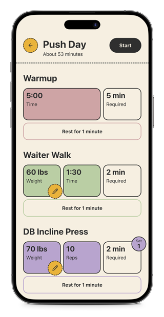
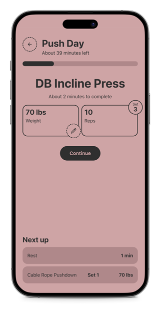

# Routine

This is a POC for a routine tracking app. It's perfect for my personal needs. It tracks a weekly workout schedule where parameters can be adjusted run-to-run. Lots of services with similar feature sets; I've yet to see one that is lean and enjoyable to use.

## Demo

You can try a demo here: https://rbenj.github.io/routine-poc/

Desktop is fine enough, but it's really intended to be utilized on a phone while on the go.

  
  

## Setup

Bare bones Vite... `npm install`, then `npm run dev`. Default Vite port... http://localhost:5173/. Prefer to run in a [devcontainer](https://code.visualstudio.com/docs/devcontainers/containers), configuration is included.

## Roadmap

This project is currently ingesting my actual weekly routine from a JSON file with some default parameters. Next major step is to add a data store and CRUD for managing plans.

See the [ROADMAP.md](./ROADMAP.md) for a more complete list of what's next.

## LLM Usage

- Prototyped with OpenAI o3 and Claude Sonnet 4 to validate core flows (code largely scrapped).
- Generated unit and integration test coverage with Claude Sonnet 4; manual tuning still needed.

## Vocab

- *Plan*: A list of _tasks_ that can be assigned and completed one-off or on a schedule.
- *Task*: A single activity to be completed in a _plan_.
- *Rest*: A specialized type of _task_, but nothing to complete other than chilling out for a period of time.
- *Field*: The smallest unit of work to be completed in a _task_. These are the details that define a _task_.
